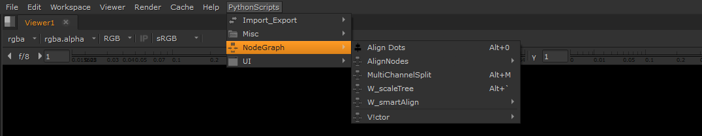

<h1 align="center"> 
      
      <br> PythonScripts Toolkit for Nuke
</h1>

<br />

## Perface :books:

> 当你看到这个页面时说明你可以访问GitHub（很显然你看到了一句废话）, 若会科学上网请使用代理访问 :rocket:（无需多言），若不会可略过。

我个人平时整合并制作了一个名为 `nuLibrary` :toolbox: 的工具库， nuLibrary 内含有 `Gizmos` :hammer_and_wrench:， `PthonScripts` :hammer_and_wrench:， `Series` :hammer_and_wrench: 三个不同的工具包，里面含有我平时搜集并使用的 gizmo 和 script，大部分来自于网络，少部分为自己编写。

现只公开发布 `PythonScripts` :hammer_and_wrench:，后续可能会更新，但频率不会太高（或许半年？一年？三年？更新一次），前提是只要我还在呼吸。 `Gizmos` :hammer_and_wrench: 和 `Series` :hammer_and_wrench: 主要针对于我个人使用习惯做了 layout，与 `NukeSurvivalToolkit` 中的内容类似，其表面的最大区别是在 Nuke 中的 layout 不一样，所以暂不公开，无过多意义。

在 `PythonScripts` :hammer_and_wrench: 中整合了我在 Nuke 中所使用的一些较为`实用`, `高效`, 且`优雅`的 Scripts（脚本、命令或者称之为插件 :electric_plug:）,并在 Nuke 中做了 layout，这几乎改变了我的工作方式。

<br />

## Download :books:

> 若熟悉GitHub可略过

举例：

点击右侧的 `Releases` > `latest` 会进入到以下页面

点击 `Assets` 下的第一个就可以了。

<br />

## Install :books:

 若熟悉安装可略过

1. 将 `nuLibrary` :file_folder: 文件夹复制到用户目录的 `.nuke` :file_folder: 文件夹内
2. - 若 `.nuke` :file_folder: 文件夹内没有 `init.py` 文件，则创建一个 `init.txt` 文件，并将以下代码复制到文件中， 最后将 `init.txt` 更改为 `init.py`
   - 若 `.nuke` :file_folder: 文件夹内存在 `init.py` 文件，打开 `init.py`，并将以下代码复制到文件中。
   
     （右键用记事本方式打开或用你会的一种方式打开。若不会打开，请将电脑关 :chicken:!）
      
     ```python
     import nuke

     nuke.pluginAddPath('./nuLibrary')
     ```

> 想要深入了解 nuke 插件安装？请查看官方指导 [Installing Plug-ins](https://learn.foundry.com/nuke/developers/latest/pythondevguide/installing_plugins.html#installingplugins-ref-label)

<br />

什么 :question: 你还想了解怎么 uninstall :question: 直接 delete :wastebasket: 即可~
- 只需删除 `.nuke` :file_folder: 文件夹内 `init.py` 中的下列代码， `nuLibrary` :file_folder: 文件夹可删可不删~

  ```python
  nuke.pluginAddPath('./nuLibrary')
  ```

<br />

## Introduce :books:

:heavy_check_mark: 完成安装后可以看到位于 Nuke 顶部菜单栏右侧的 `PythonScripts` 一栏，并且内有显示 **`快捷键`** ，敬请查看。

<p align="center"></p>

:scroll: 以下为 `PythonScripts` :hammer_and_wrench: 中各种分类的介绍，分类方式与 NukePedia 中一致，目前分了 **3D** :label:、**Import_Export** :label:、**Misc** :label:、**NodeGraph** :label:、**UI** :label: 五类。有关 scripts 的快捷键不在下面介绍了，安装后请在 Nuke 中查看。

> 如若感兴趣建议尽可能地熟悉 `W_hotbox` :hammer: （下面有介绍），**`快速高效`**、**`高度自定义化`**、**`大幅减少了对快捷键的占用`**。完全熟悉后，会使你 `锦上添花` :sunflower: `如虎添翼` :eagle:。

<br />

#### 3D :label:
- **`animatedSnap3D`**
  - > _作者：Ivan Busquets
  - > _使用方法：[https://www.nukepedia.com/python/3d/animatedsnap3d](https://www.nukepedia.com/python/3d/animatedsnap3d)_

<br />

#### Import_Export :label:
- **`CollectFiles`**
  - > _作者：Mariano Antico_
  - > _使用方法：[https://www.nukepedia.com/python/import/export/collectfiles](https://www.nukepedia.com/python/import/export/collectfiles)_

<br />

#### Misc :label:
- `Auto open .nk as NukeX`
  - > _作者：Max van Leeuwen_
  - > _使用方法：仅针对于 Windows 需要到文件路径 .nuke/nuLibrary/PythonScripts/Misc/Auto_open_nk_as_NukeX 下手动运行。[https://www.nukepedia.com/miscellaneous/auto-open-nk-as-nukex](https://www.nukepedia.com/miscellaneous/auto-open-nk-as-nukex)_

- `Default`
  - > _作者：Simon Jokuschies_
  - > _使用方法：[https://www.nukepedia.com/python/misc/default-automatic-knobdefaults](https://www.nukepedia.com/python/misc/default-automatic-knobdefaults)_

- `openExploreDir`
  - > _作者：Lundy Hu (Yes, It's me !), （原名：winExploreDir, 原作者：Thorsten 编写， Varun Hadkar 发布。思路来源于 Thorsten，名称和代码现已全部被我更改，已适用于 Windows、Linux、Mac，并添加了新功能）_
  - > _使用方法：_

- `readFromWrite`
  - > _作者：未知_
  - > _使用方法：表里如一，和字面意思一样。可使用快捷键从选定的 Write 节点读取输出的图像。_

<br />

#### NodeGraph :label:
- `AlignNodes`
  - > _作者：Frank Rueter_
  - > _使用方法：快捷键已被我更改，配合 `W_smartAlign` 一同使用。[https://www.nukepedia.com/python/nodegraph/alignnodes](https://www.nukepedia.com/python/nodegraph/alignnodes)，_

- `MultiChannelSplit`
  - > _作者：Simon Jokuschies_
  - > _使用方法：[https://www.nukepedia.com/python/nodegraph/multichannelsplit_v03](https://www.nukepedia.com/python/nodegraph/multichannelsplit_v03)_

- `V_Tools`
  - > _作者： Victor Perez_
  - > _使用方法：只保留了 V_ConvertGizmosToGroups，V_PostageStampGenerator，V_PresetBackdrop 这三个 scripts（另外一个由上面 readFromWrite 替代）。功能同字面意思一样。_

- `W_scaleTree`
  - > _作者：Wouter Gilsing_
  - > _使用方法：[https://www.nukepedia.com/python/nodegraph/w_scaletree](https://www.nukepedia.com/python/nodegraph/w_scaletree)_

- `W_smartAlign`
  - > _作者：Wouter Gilsing_
  - > _使用方法：快捷键已被我更改，配合 `AlignNodes` 一同使用。[https://www.nukepedia.com/python/nodegraph/w_smartalign](https://www.nukepedia.com/python/nodegraph/w_smartalign)_

<br />

#### UI :label:
- `AnimationMaker`
  - > _作者：David Emeny_
  - > _使用方法：[https://www.nukepedia.com/python/ui/animation-maker](https://www.nukepedia.com/python/ui/animation-maker)_

- `Channel_Hotbox`
  - > _作者：Falk Hofmann_
  - > _使用方法：[https://www.nukepedia.com/python/ui/channel-hotbox](https://www.nukepedia.com/python/ui/channel-hotbox)_

- `CloseAllProperties`
  - > _作者：Max van Leeuwen_
  - > _使用方法：使用对应快捷键可一次关闭所有已打开的 Node 面板和 Project Settings 面板。 对于习惯使用 Node 浮动面板的人非常适合（例如我）, 可以节省对操作空间的占用，nice :clap: ！_

- `SearchReplacePanel`
  - > _作者：Frank Rueter_
  - > _使用方法：[https://www.nukepedia.com/python/ui/searchreplacepanel](https://www.nukepedia.com/python/ui/searchreplacepanel)_

- `W_hotbox `
  - > _作者：Wouter Gilsing_
  - > _使用方法：[https://www.nukepedia.com/python/ui/w_hotbox](https://www.nukepedia.com/python/ui/w_hotbox)，我人人编写的很多 scripts 也放在了 W_hotbox 中，因为实在是太方便了。_
