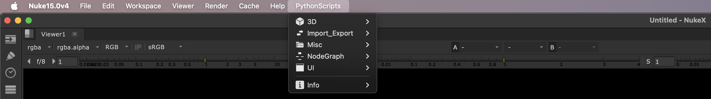
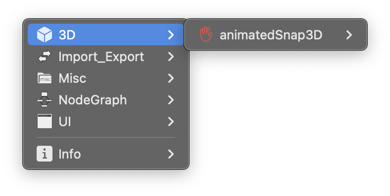
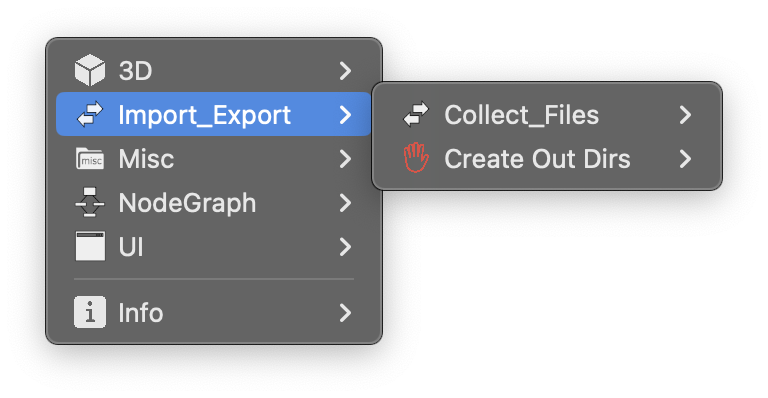
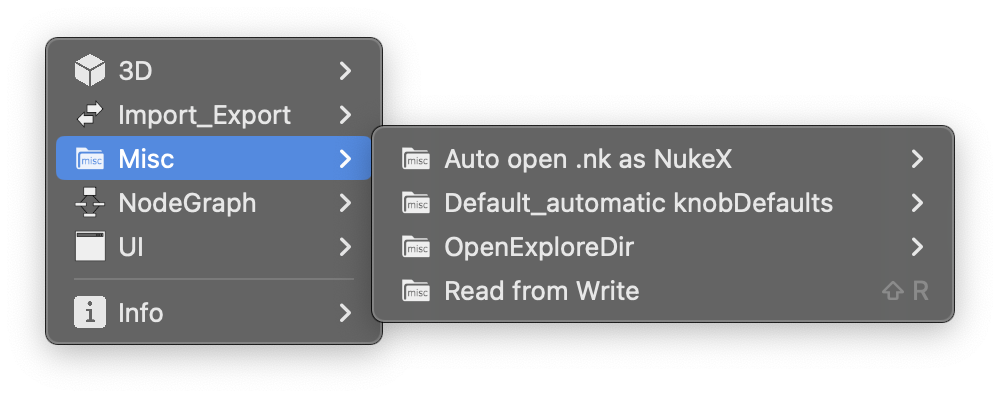
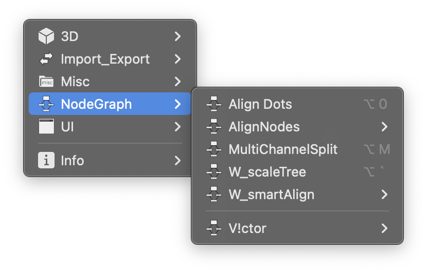
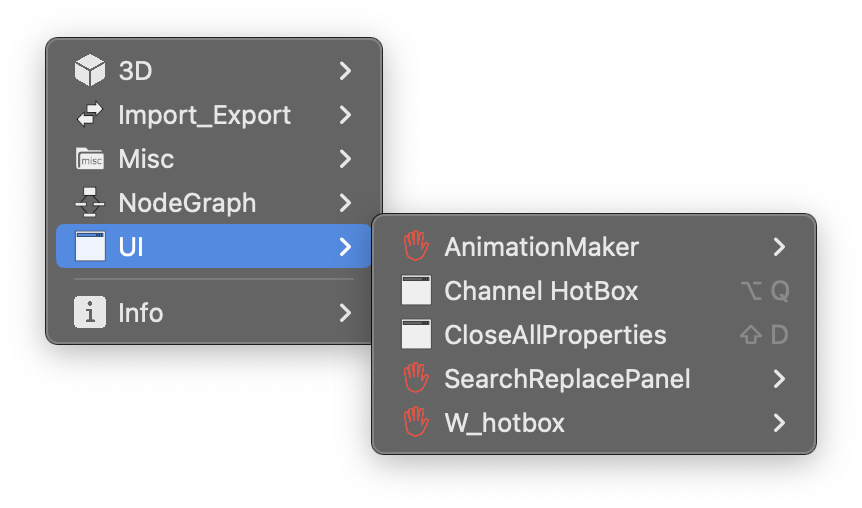

<h1 align="center"> 
      
      <br />PythonScripts Toolkit for Nuke
</h1>

<br />

<p align="center">
    <a href="https://img.shields.io/github/commit-activity/m/isLundy/Nuke-PythonScripts-Toolkit?color=%23FF4500&style=plastic">
        </a>
    <a href="https://img.shields.io/github/last-commit/isLundy/Nuke-PythonScripts-Toolkit?color=%2300BFFF&style=plastic">
        </a>
    <a href="https://img.shields.io/github/repo-size/isLundy/Nuke-PythonScripts-Toolkit?color=%237B68EE&style=plastic">
        </a>
    <a href="https://github.com/isLundy/Nuke-PythonScripts-Toolkit/releases/latest">
        </a>
</p>

<br />

## 目录 :books:
- [前言 :books:](#前言-books)
- [下载 :books:](#下载-books)
- [安装 :books:](#安装-books)
- [介绍 :books:](#介绍-books)
  * [PythonScripts 菜单 :scroll:](#pythonscripts-菜单-scroll)
    + [3D :label:](#3d-label)
    + [Import_Export :label:](#import_export-label)
    + [Misc :label:](#misc-label)
    + [NodeGraph :label:](#nodegraph-label)
    + [UI :label:](#ui-label)
  * [添加新脚本的思路 :bulb:](#添加新脚本的思路-bulb)
    + [针对非特定节点类的脚本 :card_index_dividers:](#针对非特定节点类的脚本-card_index_dividers)
    + [针对特定节点类的脚本 :card_index_dividers:](#针对特定节点类的脚本-card_index_dividers)
  * [PythonScripts 目录结构 :file_folder:](#pythonscripts-目录结构-file_folder)
  * [问答 :question: :exclamation:](#问答-question-exclamation)
- [附录 :books:](#附录-books)
- [证书 :books:](#证书-books)
> 可单击标题直接导航到该部分。

<br />

## 前言 :books:

很久前整合制作了一个名为 `nuLibrary` 的工具库（大约是在2018年12月，后续一直慢慢地优化），`nuLibrary` 内含有 `Gizmos` :toolbox:、 `PythonScripts` :toolbox:、 `Series` :toolbox: 三个不同的工具包，里面含有我平时搜集并使用的 gizmos 和 scripts，大部分来自网络，少部分为自己编写。

`nuLibrary` 一直在作为个人使用，最近决定公开发布其中的 `PythonScripts` :toolbox:。 `Gizmos` :toolbox: 和 `Series` :toolbox: 主要针对于我个人使用习惯做了排版布局，与 [`NukeSurvivalToolkit`](https://github.com/CreativeLyons/NukeSurvivalToolkit_publicRelease) 中的内容相似，其表面的最大区别就是在 Nuke 中的布局，所以暂不公开，无太多意义。

在 `PythonScripts` :toolbox: 中整合了我在 Nuke 中所使用的一些较为 **`实用`**、 **`高效`** 且 **`优雅`** 的 scripts（脚本，或者称之为插件 :electric_plug:），这完全改变了我与 Nuke 的交互方式。

<br />

## 下载 :books:

> 若熟悉 GitHub 可略过

点击右侧的 `Releases` - `latest`， 

> 没找到 ？ 那就点击 [此处](https://github.com/isLundy/Nuke-PythonScripts-Toolkit/releases/latest) 吧 ！

进入页面后点击 `Assets` 下的第一个 `nuLibrary_vX.X.X.zip` 链接 :link: 即可。

<br />

## 安装 :books:
要求： `NukeX 13 或更新版本`

> 已测试 Windows 10，Linux CentOS 7，macOS Sonoma。

> 若熟悉安装可略过

1. 下载 `.zip` :briefcase: 文件解压后将 `nuLibrary` :file_folder: 文件夹复制到用户目录的 `.nuke` :file_folder: 文件夹内。
2. - 若 `.nuke` :file_folder: 文件夹内没有 `init.py` 文件，则新建一个 `init.txt` 文件，并将以下代码复制到文件中，保存关闭，最后将 `init.txt` 更改为 `init.py`
   - 若 `.nuke` :file_folder: 文件夹内存在 `init.py` 文件，打开 `init.py`，并将以下代码复制到文件中，保存关闭。
   
     （ `右键以记事本方式打开文件` 或用 `其他熟悉的一种方式打开`）
      
     ```python
     import nuke

     nuke.pluginAddPath('./nuLibrary')
     ```
3. 打开 Nuke :radioactive: ，尽情享用 :yum: ~

> 想要深入了解 Nuke 插件安装？请查看官方文档 [Installing Plug-ins](https://learn.foundry.com/nuke/developers/latest/pythondevguide/installing_plugins.html#installingplugins-ref-label)

<br />

什么 :question: 你还想了解怎么 uninstall :question: 直接 delete 即可~
- 只需删除 `.nuke` :file_folder: 文件夹下 `init.py` 中的下列代码， 删除 `nuLibrary` :file_folder: 文件夹。

  ```python
  nuke.pluginAddPath('./nuLibrary')
  ```

<br />

## 介绍 :books:

### PythonScripts 菜单 :scroll:

完成安装后 :heavy_check_mark: 可以看到位于 Nuke 顶部菜单栏右侧的 `PythonScripts` 菜单 :scroll:。

<p align="center"></p>
<p align="left"></p>
<p align="left"></p>
<p align="left"></p>
<p align="left"></p>
<p align="left"></p>

<br />

---

`PythonScripts` :toolbox: 遵循 [`NukePedia`](https://www.nukepedia.com/python-downloads) 的分类方式，以下为各种分类文件夹内脚本的介绍。目前存在`3D` :label:、`Import_Export` :label:、`Misc` :label:、`NodeGraph` :label:、`UI` :label: 五种分类（以后可能会根据相应脚本继续添加分类）。有关快捷键，请在 `PythonScripts` 菜单 :scroll: 内查看。

> 如若感兴趣建议尽可能地熟悉 `W_hotbox`（[下面](#gotohere)有介绍），**`快速高效`**、**`高度自定义化`**、**`大幅减少了对快捷键的占用`**。完全熟悉后，会使你 **`锦上添花`** :sunflower:，若同时了解 Python 更是 **`如虎添翼`** :eagle:。

<br />

#### 3D :label:
- `animatedSnap3D`

  - > _作者：Ivan Busquets_
  - > _使用方法：[https://www.nukepedia.com/python/3d/animatedsnap3d](https://www.nukepedia.com/python/3d/animatedsnap3d)_

<br />

#### Import_Export :label:
- `CollectFiles`
  - > _作者：Mariano Antico_
  - > _使用方法：[https://www.nukepedia.com/python/import/export/collectfiles](https://www.nukepedia.com/python/import/export/collectfiles)_

- `Create Out Dirs`
  - > _来源：[NUKE Python Developer’s Guide](https://learn.foundry.com/nuke/developers/latest/pythondevguide/asset.html?highlight=createoutdirs#custom-write-node)_
  - > _使用方法：无需操作，打开 Nuke 后自动启用。<p>它会在 `Write` 节点开始渲染前的那一刻自动检测当前 `Write` 节点的文件目录是否存在，若为否，则自动先创建该目录然后再渲染。相当于勾选 :ballot_box_with_check: 了 `Write` 节点中的 `create directories` 选项，只不过它忽略 `create directories` 选项，无论是否勾选， `CreateOutDirs` 都会运行 :heavy_check_mark:。</p>_

<br />

#### Misc :label:
- `Auto open .nk as NukeX`
  - > _作者：Max van Leeuwen_
  - > _使用方法：仅针对于 Windows 系统。自动将 .nk 文件与 NukeX 关联，双击 Nuke 工程将自动以 NukeX 打开。需要到文件路径 .nuke/nuLibrary/PythonScripts/Misc/Auto_open_nk_as_NukeX 下将 `NukeXByDefault.reg` 文件右键以记事本方式打开，更改路径中的 **`版本号`**，保存后，双击运行，一劳永逸。_

- `Default`
  - > _作者：Simon Jokuschies_
  - > _使用方法：[https://www.nukepedia.com/python/misc/default-automatic-knobdefaults](https://www.nukepedia.com/python/misc/default-automatic-knobdefaults)_

- `openExploreDir`
  - > _（原名：winExploreDir，原作者：Thorsten 编写，Varun Hadkar 发布。思路来源于 Thorsten，代码和名字现已全部被我更改，已适用于 Windows、Linux、Mac，并添加了新功能，也发布在了 [`NukePedia`](https://www.nukepedia.com/python/misc/openexploredir) 上。）_
  - > _使用方法：[https://github.com/isLundy/openExploreDir#features](https://github.com/isLundy/openExploreDir#features)_

- `read From Write`
  - > _作者：未知_
  - > _使用方法：表里如一，同字面意思。可使用快捷键从选定的 Write 节点读取已渲染的图像。_

<br />

#### NodeGraph :label:
- `AlignDots`
  - > _作者：Max van Leeuwen_
  - > _使用方法：[https://www.nukepedia.com/python/nodegraph/aligndots](https://www.nukepedia.com/python/nodegraph/aligndots)（快捷键已被我更改）_

- `AlignNodes`
  - > _作者：Frank Rueter_
  - > _使用方法：[https://www.nukepedia.com/python/nodegraph/alignnodes](https://www.nukepedia.com/python/nodegraph/alignnodes)（快捷键已被我更改）_

- `MultiChannelSplit`
  - > _作者：Simon Jokuschies_
  - > _使用方法：[https://www.nukepedia.com/python/nodegraph/multichannelsplit_v03](https://www.nukepedia.com/python/nodegraph/multichannelsplit_v03)_

- `V_Tools`
  - > _作者： Victor Perez_
  - > _使用方法：只保留了 V_ConvertGizmosToGroups，V_PostageStampGenerator，V_PresetBackdrop 这三个 scripts（共四个，另外一个由 `readFromWrite` 替代）。功能同字面意思，作用于已选定的节点。_

- `W_scaleTree`
  - > _作者：Wouter Gilsing_
  - > _使用方法：[https://www.nukepedia.com/python/nodegraph/w_scaletree](https://www.nukepedia.com/python/nodegraph/w_scaletree)，在 Linux 系统上该快捷键更改为 Alt + 1，原快捷键被系统所用。_

- `W_smartAlign`
  - > _作者：Wouter Gilsing_
  - > _使用方法：[https://www.nukepedia.com/python/nodegraph/w_smartalign](https://www.nukepedia.com/python/nodegraph/w_smartalign)（快捷键已被我更改）_

<br />

 > _`AlignDots`、`AlignNodes`、`W_smartAlign` 现在三者的快捷键已关联到 `Alt + 0 2 4 5 6 8`，更改这三个脚本快捷键是为了相互配合适用，在使用数字键盘对齐节点时极为便利。_

<br />

#### UI :label:
- `AnimationMaker`
  - > _作者：David Emeny_
  - > _使用方法：[https://www.nukepedia.com/python/ui/animation-maker](https://www.nukepedia.com/python/ui/animation-maker)，与 [ExpressionWaveGenerator](https://www.nukepedia.com/gizmos/other/expressionwavegenerator) gizmo 相似，都能达到同样的动画效果。_

- `Channel_Hotbox`
  - > _作者：Falk Hofmann_
  - > _使用方法：[https://www.nukepedia.com/python/ui/channel-hotbox](https://www.nukepedia.com/python/ui/channel-hotbox)_

- `CloseAllProperties`
  - > _作者：Max van Leeuwen_
  - > _使用方法：快捷键已更改为源自 Josh Parks 使用的热键（熟练后很好用 :clap:）。使用快捷键可一次关闭所有已打开的 Node 面板和 Project Settings 面板。 对于习惯使用 Node 浮动面板的人非常适合（例如我 \~）, 可以减少对操作空间的占用，nice :clap: ！_

- `SearchReplacePanel`
  - > _作者：Frank Rueter_
  - > _使用方法：[https://www.nukepedia.com/python/ui/searchreplacepanel](https://www.nukepedia.com/python/ui/searchreplacepanel)_

<a name="gotohere"></a>

- `W_hotbox `
  - > _作者：Wouter Gilsing_
  - > _使用方法：[https://www.nukepedia.com/python/ui/w_hotbox](https://www.nukepedia.com/python/ui/w_hotbox)，我个人编写的很多脚本也放在了 W_hotbox 中。_

<br />

---

### 添加新脚本的思路 :bulb:
> 对于我个人编写的脚本是采用下面的方式.对于其他作者的脚本，如果其作者将脚本发布在了 `NukePedia上` ，则按照 `NukePedia` 上的分类规则。

#### 针对非特定节点类的脚本 :card_index_dividers:
- 使用`频率很高`且`需要设置快捷键`，一般放在 `PythonScripts` 菜单中。
- 使用`频率较低`且`无需设置快捷键`，一般放在 `PythonScripts` 菜单中。
- 使用`频率很高`但`不需要设置快捷键`，一般放在 `W_hotbox` 中.

#### 针对特定节点类的脚本 :card_index_dividers:
- 一般放在 `W_hotbox` 中。

<br />

---

### PythonScripts 目录结构 :file_folder:
> 若不熟悉 Python 可略过。

- 在现有基础上添加脚本

  安装到 .nuke :file_folder: 文件夹后可以看到以下结构示例：

  | .nuke | /nuLibrary | /PythonScripts | /UI  | /AnimationMaker<br />/Channel_Hotbox<br />/CloseAllProperties<br />/SearchReplacePanel<br />/W_hotbox | script.py |
  | :---  | :---       | :---           | :--- | :---            | :---        |
  |       | 工具库名 :arrow_heading_up: | 工具包名 :arrow_heading_up: | 分类名 :arrow_heading_up: | 脚本文件夹名 :arrow_heading_up: | 脚本文件 :arrow_heading_up: |
  |       |            | 当前目录 :arrow_heading_up: | 二级目录 :arrow_heading_up: | 三级目录 :arrow_heading_up: |             |

  `.nuke/nuLibrary/PythonScripts/init.py` 会 `自动` 添加 `PythonScripts`目录下的 `第三级目录`的路径，所有的脚本都可以放到相应的 `三级目录` 下。

  由于 PythonScripts 下的二级目录是分类名，无需添加到 Nuke 的插件路径中，所以请勿在二级目录下放置文件，务必建立文件夹 :file_folder:。

  `.nuke/nuLibrary/init.py` 会 `自动` 添加 `nuLibrary` 目录下的目录路径（原 nuLibrary 下有 Gizmos、PythonScripts、Series 文件夹，因现只公开 PythonScripts，所以现在是会自动添加 PythonScripts 文件夹路径）。
  

- 自定义方式添加脚本

  请自行修改 `init.py` 和 `menu.py`。

<br />

---

### 问答 :question: :exclamation:

有任何问题可随时在[此处](https://github.com/isLundy/Nuke-PythonScripts-Toolkit/discussions)发起讨论～

<br />

## 附录 :books:

在此非常感谢 `Wouter Gilsing`、`Frank Rueter`、`Max van Leeuwen`、`Josh Parks`、`Falk Hofmann`、`David Emeny`、`Victor Perez`、`Simon Jokuschies`、`Mariano Antico`、`Ivan Busquets`、`Thorsten`、`Varun Hadkar` 以及 Nuke 社区的其他贡献者。 :sparkling_heart:

> 排名不分先后

<br />

## 证书 :books:

<br />

<p align="center">
    <a href="LICENSE">
        </a>
</p>

<br />
